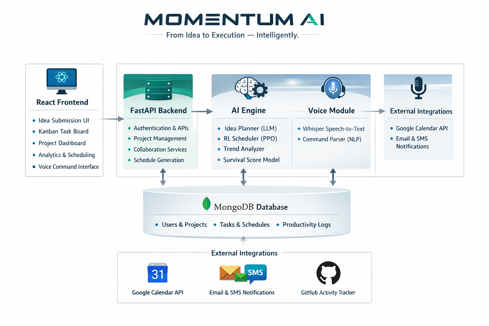
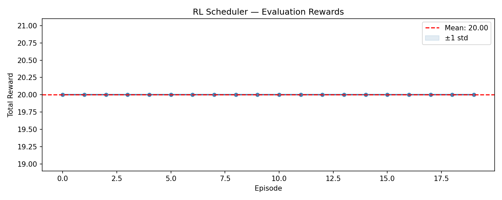
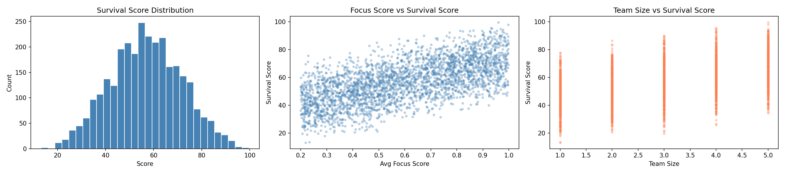
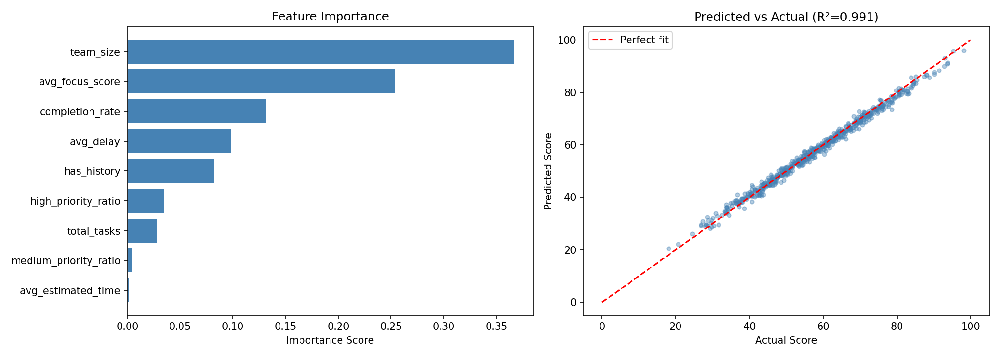

<div align="center">

```
███╗   ███╗ ██████╗ ███╗   ███╗███████╗███╗   ██╗████████╗██╗   ██╗███╗   ███╗     █████╗ ██╗
████╗ ████║██╔═══██╗████╗ ████║██╔════╝████╗  ██║╚══██╔══╝██║   ██║████╗ ████║    ██╔══██╗██║
██╔████╔██║██║   ██║██╔████╔██║█████╗  ██╔██╗ ██║   ██║   ██║   ██║██╔████╔██║    ███████║██║
██║╚██╔╝██║██║   ██║██║╚██╔╝██║██╔══╝  ██║╚██╗██║   ██║   ██║   ██║██║╚██╔╝██║    ██╔══██║██║
██║ ╚═╝ ██║╚██████╔╝██║ ╚═╝ ██║███████╗██║ ╚████║   ██║   ╚██████╔╝██║ ╚═╝ ██║    ██║  ██║██║
╚═╝     ╚═╝ ╚═════╝ ╚═╝     ╚═╝╚══════╝╚═╝  ╚═══╝   ╚═╝    ╚═════╝ ╚═╝     ╚═╝    ╚═╝  ╚═╝╚═╝
```

**From Idea to Execution — Intelligently.**

<br/>

[](https://fastapi.tiangolo.com)
[](https://reactjs.org)
[](https://mongodb.com)
[](https://python.org)
[](https://docker.com)
[](LICENSE)

<br/>

> **Momentum AI** is an AI-powered idea execution platform that transforms raw concepts into structured project roadmaps, adaptive RL-generated schedules, auto-built Kanban boards, and collaborative team workspaces — driven by large language models and reinforcement learning.

</div>

---

## The Problem: The Idea Blackhole

Every day, thousands of promising ideas disappear — not because they lack potential, but because they lack structure. Students, developers, and creators generate valuable concepts that never progress past the initial spark due to the absence of planning, scheduling, and sustained motivation.

**Momentum AI exists to solve this.**

---

## Table of Contents

- [Overview](#overview)
- [Problem Statement](#problem-statement)
- [Product Vision](#product-vision)
- [Features](#features)
- [System Architecture](#system-architecture)
- [AI Pipeline](#ai-pipeline)
- [Reinforcement Learning Scheduler](#reinforcement-learning-scheduler)
- [Technology Stack](#technology-stack)
- [Project Structure](#project-structure)
- [Key Architectural Separation](#key-architectural-separation)
- [Database Schema](#database-schema)
- [Evaluation Methodology](#evaluation-methodology)
- [Future Roadmap](#future-roadmap)
- [Success Metrics](#success-metrics)
- [License](#license)

---

## Overview

Momentum AI is an **AI-powered idea execution platform** designed to transform raw ideas into structured, actionable projects. The system analyzes user ideas and automatically generates execution plans, schedules tasks, creates collaborative workspaces, and predicts the likelihood of project completion.

By combining **artificial intelligence, reinforcement learning, and collaborative task management**, Momentum AI helps users convert inspiration into real outcomes.

---

## Problem Statement

Students and developers frequently face the following challenges:

- Ideas are not structured into actionable plans
- Projects lack clear task breakdown and scheduling
- Individuals struggle to maintain consistent productivity
- Collaborators with complementary skills are difficult to find
- Many ideas are abandoned before completion

These issues result in the loss of potentially valuable projects. Momentum AI addresses them by creating an intelligent system that **captures ideas, structures them into projects, and guides them toward successful execution**.

---

## Product Vision

The vision of Momentum AI is to build an intelligent assistant that transforms ideas into structured projects and guides individuals or teams toward successful execution through:

- **AI-driven project planning** — converting raw ideas into structured roadmaps instantly
- **Reinforcement learning scheduling** — adaptive, personalized task scheduling that improves over time
- **Collaborative task management** — role-based team workflows with auto-generated Kanban boards
- **Productivity analytics** — insights and scoring to keep projects on track

---

## Who Is This For?

| User Type | Use Case |
|-----------|----------|
| **Students** | Building academic or personal projects that need structured planning |
| **Developers** | Organizing and executing the many ideas they generate |
| **Hackathon Teams** | Rapid idea-to-execution planning during short development cycles |
| **Startup Enthusiasts** | Experimenting with and validating early-stage product concepts |

---

## Features

### AI Idea-to-Execution Planner

Submit any project idea and receive a fully structured execution roadmap in seconds, generated by an LLM.

```
Input:  "AI Lecture Summarizer"

Output:
  Day 1 — Research speech-to-text APIs
  Day 2 — Design backend architecture
  Day 3 — Implement summarization model
  Day 4 — Build user interface
  Day 5 — Testing and optimization
```

---

### Reinforcement Learning Scheduling Engine

A self-improving scheduling agent built with PPO that learns from your productivity patterns and dynamically generates optimized task schedules — adapting to deadlines, workload, and availability over time.

The RL agent considers:
- User availability and working hours
- Task deadlines and dependencies
- Workload balance across the team
- Historical productivity behavior

---

### Auto-Generated Kanban Task Board

Every roadmap is instantly converted into a visual Kanban board. No manual setup required.

| To Do | In Progress | Completed |
|-------|-------------|-----------|
| Research APIs | Build summarizer | System design |
| Set up MongoDB | Write unit tests | Docker config |
| Build UI components | API integration | — |

Each task card includes: **description · priority · assigned member · deadline**

---

### Role-Based Collaboration

Invite team members and assign structured roles so every task has a clear owner.

| Role | Responsibility |
|------|---------------|
| Project Lead | Overall direction and delivery |
| Backend Developer | API and server-side logic |
| Frontend Developer | UI/UX implementation |
| ML Engineer | Model development and training |
| Researcher | Domain and market research |
| Designer | Visual design and prototyping |
| Tester | QA, validation, and testing |

---

### Voice-Enabled Task Management

Control your workspace hands-free using natural language voice commands:

```
"Add task: build login page — due tomorrow"
"Show today's schedule"
"Move the design review to Friday evening"
```

Powered by **OpenAI Whisper** speech recognition with NLP command parsing.

---

### Trend-Aware Adaptive System

Before generating your execution plan, Momentum AI scans the competitive landscape. If similar solutions already exist, it surfaces:

- Innovation opportunities and gaps
- Feature differentiation strategies
- Market positioning recommendations

This prevents investing effort into building outdated or oversaturated solutions.

---

### Idea Survival Score

A machine-learning powered prediction score (0–100) estimating your project's probability of successful completion.

```
Project:              AI Resume Analyzer
Idea Survival Score:  74 / 100  ████████████████████░░░░
Feasibility:          Strong
```

**Factors analyzed:** task complexity · team skill coverage · available time · workload distribution · historical productivity patterns

If the score is low, the system suggests improvements such as reducing scope, adding collaborators, or adjusting the timeline.

---

## System Architecture

Momentum AI is built on a modular four-layer architecture separating the frontend, backend, AI engine, and data storage for clean scalability.

```
┌──────────────────────────────────────────────┐
│             React.js Frontend                │
│  Idea Submission · Kanban · Analytics · UI   │
└─────────────────────┬────────────────────────┘
                      │  REST API
                      ▼
┌──────────────────────────────────────────────┐
│              FastAPI Backend                 │
│   Auth · Task Logic · Collaboration · APIs   │
└────┬─────────────┬───────────────┬───────────┘
     │             │               │
     ▼             ▼               ▼
┌──────────┐ ┌──────────┐ ┌───────────────────┐
│  Idea    │ │    RL    │ │  Trend Analyzer + │
│ Planner  │ │Scheduler │ │  Survival Score   │
└────┬─────┘ └────┬─────┘ └────────┬──────────┘
     │             │               │
     └─────────────┴───────────────┘
                      │
                      ▼
┌──────────────────────────────────────────────┐
│                  MongoDB                     │
│      Users · Projects · Tasks · Logs         │
└─────────────────────┬────────────────────────┘
                      │
                      ▼
┌──────────────────────────────────────────────┐
│           External Integrations              │
│    Google Calendar · Notifications · GitHub  │
└──────────────────────────────────────────────┘
```


<div align="center">
  
  <br/>
  <sub><b>Figure 1:</b> Momentum AI system architecture — showing the full flow from React frontend through FastAPI backend to the AI engine, MongoDB, and external integrations.</sub>
</div>

---

## AI Pipeline

The full processing pipeline from raw idea input to project dashboard output:

```
User Idea Input
      │
      ▼
Idea Processing  (LLM)
      │
      ▼
AI Task Generator
      │
      ▼
Kanban Board Creator
      │
      ▼
RL Scheduling Engine ◄──── Productivity Logs (feedback loop)
      │
      ▼
Trend Analyzer
      │
      ▼
Survival Score Predictor
      │
      ▼
Project Dashboard Output
```

---

## Reinforcement Learning Scheduler

Momentum AI uses **Proximal Policy Optimization (PPO)** via Stable-Baselines3 to learn and continuously improve task scheduling.

### Environment
Represents the project timeline combined with user availability windows and existing task states.

### State Space
```python
state = {
    "current_time":       datetime,
    "remaining_tasks":    List[Task],
    "task_priorities":    List[float],
    "deadlines":          List[datetime],
    "user_availability":  List[bool],
    "current_workload":   float
}
```

### Action Space
```python
actions = [
    "assign_task_to_slot",
    "delay_task",
    "prioritize_task",
    "reallocate_task"
]
```

### Reward Function

| Outcome | Reward |
|---------|--------|
| Task completed on time | `+1.0` |
| Balanced workload achieved | `+0.5` |
| Productivity improved vs. baseline | `+0.3` |
| Missed deadline | `-1.0` |
| Schedule overload detected | `-0.7` |
| Task delayed unnecessarily | `-0.4` |

The agent continuously refines its policy through interaction with real user productivity data stored in the `productivity_logs` collection, becoming increasingly personalized with use.

### RL Training — Reward Progression

The chart below shows the cumulative reward earned by the PPO agent across training episodes, demonstrating convergence toward an optimal scheduling policy.

<div align="center">
  
  <br/>
  <sub><b>Figure 1:</b> PPO agent reward progression across training episodes. The agent converges toward optimal scheduling behaviour as it learns from simulated productivity interactions.</sub>
</div>

---

## Technology Stack

| Layer | Technology |
|-------|-----------|
| **Frontend** | React.js |
| **Backend** | FastAPI (Python 3.10+) |
| **Database** | MongoDB |
| **Reinforcement Learning** | Stable-Baselines3 · PPO Algorithm |
| **Machine Learning** | Scikit-learn · XGBoost |
| **AI Idea Planner** | LLM-based task generation |
| **Voice Processing** | OpenAI Whisper |
| **Visualization** | Plotly · Recharts |
| **Calendar Integration** | Google Calendar API |
| **Notifications** | Email & SMS services |
| **Deployment** | Docker · Docker Compose |

---

## Project Structure

```
momentum-ai/
│
├── README.md
├── LICENSE
├── .gitignore
├── docker-compose.yml
├── requirements.txt
├── package.json
│
├── frontend/                        # React.js frontend
│   ├── public/
│   │   └── index.html
│   └── src/
│       ├── assets/
│       ├── components/
│       │   ├── KanbanBoard.jsx
│       │   ├── TaskCard.jsx
│       │   ├── Navbar.jsx
│       │   ├── VoiceCommand.jsx
│       │   └── SurvivalScore.jsx
│       ├── pages/
│       │   ├── IdeaSubmission.jsx
│       │   ├── ProjectDashboard.jsx
│       │   ├── ScheduleView.jsx
│       │   ├── CollaborationPage.jsx
│       │   └── AnalyticsPage.jsx
│       ├── services/
│       │   ├── api.js
│       │   ├── projectService.js
│       │   └── scheduleService.js
│       ├── hooks/
│       │   ├── useProjects.js
│       │   └── useTasks.js
│       ├── utils/
│       │   └── helpers.js
│       ├── App.js
│       └── index.js
│
├── backend/                         # FastAPI backend
│   └── app/
│       ├── main.py
│       ├── config/
│       │   └── settings.py
│       ├── routes/
│       │   ├── idea_routes.py
│       │   ├── project_routes.py
│       │   ├── task_routes.py
│       │   ├── schedule_routes.py
│       │   └── collaboration_routes.py
│       ├── services/
│       │   ├── idea_service.py
│       │   ├── task_service.py
│       │   ├── schedule_service.py
│       │   ├── trend_service.py
│       │   └── survival_score_service.py
│       ├── models/
│       │   ├── user_model.py
│       │   ├── project_model.py
│       │   ├── task_model.py
│       │   └── schedule_model.py
│       ├── database/
│       │   ├── mongodb.py
│       │   └── db_init.py
│       ├── auth/
│       │   ├── jwt_handler.py
│       │   └── auth_routes.py
│       └── utils/
│           ├── logger.py
│           └── validators.py
│
├── ai_engine/                       # AI systems
│   ├── idea_planner/
│   │   ├── prompt_templates.py
│   │   └── idea_to_tasks.py
│   ├── rl_scheduler/
│   │   ├── environment.py
│   │   ├── reward_function.py
│   │   ├── train_model.py
│   │   └── scheduler_agent.py
│   ├── survival_score/
│   │   ├── feature_engineering.py
│   │   ├── train_model.py
│   │   └── predictor.py
│   └── trend_analyzer/
│       ├── market_scanner.py
│       └── innovation_recommender.py
│
├── voice_interface/
│   ├── speech_to_text.py
│   └── command_parser.py
│
├── integrations/
│   ├── calendar/
│   │   └── google_calendar.py
│   │
│   ├── notifications/
│   │   ├── email_service.py
│   │   └── sms_service.py
│   │
│   └── github_activity/
│       └── activity_analyzer.py
│
├── models/                          # Trained model assets & evaluation charts
│   ├── dataset_exploration.png
│   ├── rl_eval_rewards.png
│   └── survival_score_results.png
│
├── data/
│   ├── training_data/
│   └── sample_projects/
│
├── tests/
│   ├── test_api.py
│   ├── test_scheduler.py
│   └── test_ai_models.py
│
└── deployment/
    ├── Dockerfile.backend
    ├── Dockerfile.frontend
    └── kubernetes/
        └── deployment.yaml
```

---

## Key Architectural Separation

Momentum AI follows a modular architecture where each major component is separated into a dedicated layer. This design improves scalability, maintainability, and allows independent development of AI models, backend services, and the frontend interface.

### Frontend

The frontend is implemented using React.js and serves as the main user interface of the system. It communicates with the backend exclusively through REST APIs.

Responsibilities:
- Idea submission interface for entering new project ideas
- Visualization of AI-generated Kanban boards
- Project collaboration dashboard for team members
- Analytics dashboards showing productivity insights
- Voice command interface for task management
- Schedule visualization and calendar integration

### Backend

The backend is built using FastAPI, providing a high-performance asynchronous API framework. It manages the core system logic and acts as the bridge between the frontend and the AI engine.

Responsibilities:
- API endpoints for all project and task operations
- Business logic for task creation and management
- Authentication and user management
- Collaboration and role assignment logic
- Integration with the reinforcement learning scheduling engine
- Communication with AI modules for idea planning and prediction

### AI Engine

The AI Engine is a dedicated module responsible for all artificial intelligence and machine learning capabilities. It operates independently from the backend to allow flexible experimentation and model updates.

**Idea Planner** — Converts raw project ideas into structured execution plans using LLM-based task generation.

**RL Scheduler** — Dynamically optimizes task schedules using reinforcement learning. The agent learns from user behavior and improves over time by considering available time slots, task priorities, dependencies, and productivity patterns.

**Survival Score Predictor** — Predicts the likelihood that a project will be completed successfully, based on task complexity, team skill coverage, available time, and historical productivity data.

**Trend Analyzer** — Examines whether similar solutions already exist and suggests feature improvements, innovation opportunities, and differentiation strategies to keep projects competitive.

### Integrations

Momentum AI integrates with external services to enhance productivity and project monitoring.

**Google Calendar** — Synchronizes AI-generated schedules with user calendars, enabling automatic reminders and real-time updates.

**Notification Services** — Keeps users engaged through email notifications, task reminders, and collaboration alerts.

**GitHub Activity** — Monitors commits, pull requests, and repository activity to track development progress and feed into productivity metrics.

---

## Database Schema

Momentum AI uses **MongoDB** — a NoSQL document database suited for the flexible, nested structures that projects, tasks, and schedules require.

### `users`
```json
{
  "_id": "ObjectId",
  "name": "String",
  "email": "String",
  "password_hash": "String",
  "skills": ["React", "Python", "Machine Learning"],
  "role": "String",
  "created_at": "Date",
  "last_login": "Date",
  "productivity_profile": {
    "peak_hours": [10, 11, 14],
    "avg_task_completion_time": 45
  }
}
```

### `projects`
```json
{
  "_id": "ObjectId",
  "title": "AI Resume Analyzer",
  "description": "String",
  "creator_id": "ObjectId",
  "team_members": ["ObjectId"],
  "roles": { "user_id": "role" },
  "idea_survival_score": 74,
  "trend_analysis": {
    "competition_level": "medium",
    "suggested_improvements": ["Add ATS scoring", "Include LinkedIn integration"]
  },
  "status": "active | completed | paused",
  "created_at": "Date"
}
```

### `tasks`
```json
{
  "_id": "ObjectId",
  "project_id": "ObjectId",
  "title": "Build NLP Parsing Model",
  "description": "String",
  "priority": "high | medium | low",
  "assigned_to": "ObjectId",
  "status": "To Do | In Progress | Completed",
  "deadline": "Date",
  "estimated_time": 120,
  "created_by_ai": true
}
```

### `schedules`
```json
{
  "_id": "ObjectId",
  "user_id": "ObjectId",
  "project_id": "ObjectId",
  "tasks": ["ObjectId"],
  "schedule_slots": [
    {
      "task_id": "ObjectId",
      "start_time": "Date",
      "end_time": "Date"
    }
  ],
  "generated_by_rl": true,
  "updated_at": "Date"
}
```

### `productivity_logs`
```json
{
  "_id": "ObjectId",
  "user_id": "ObjectId",
  "task_id": "ObjectId",
  "completion_time": 38,
  "delay_minutes": 5,
  "focus_score": 0.87,
  "timestamp": "Date"
}
```

> `productivity_logs` feed directly into the RL scheduler as training data, enabling the system to learn from real user behavior and continuously improve its scheduling decisions.

---

## Evaluation Methodology

The RL scheduler is evaluated against three baseline scheduling methods to validate its effectiveness.

### Dataset Exploration

The training dataset was analyzed to understand the distribution of task priorities, estimated durations, and productivity patterns across simulated user profiles.

<div align="center">
  
  <br/>
  <sub><b>Figure 2:</b> Exploratory data analysis of the training dataset — showing distributions of task priorities, estimated durations, delay patterns, and focus scores across simulated user profiles.</sub>
</div>

### Baseline Comparisons

| Baseline | Description |
|----------|-------------|
| **Rule-Based** | Fixed priority ordering — highest priority task always scheduled first |
| **FCFS** | First-come, first-served — tasks scheduled in submission order |
| **Fixed Time Slots** | Static, pre-assigned time blocks regardless of task dependencies |

### Evaluation Metrics

| Metric | Description |
|--------|-------------|
| **Task Completion Rate** | % of tasks completed before their deadline |
| **Schedule Efficiency** | Optimal utilization of available working hours |
| **Average Task Delay** | Mean delay in minutes across all scheduled tasks |
| **Productivity Score** | Composite of completion time, focus duration, and schedule adherence |

### Experimental Setup

1. Simulated productivity datasets are generated across diverse user profiles
2. All four scheduling strategies are applied to identical task sets
3. The RL agent trains through repeated interactions with the scheduling environment
4. Performance is measured across training episodes and compared against all baselines

### Survival Score Model — Results

The Idea Survival Score predictor was trained on simulated project outcome data. The chart below shows model performance across evaluation folds.

<div align="center">
  
  <br/>
  <sub><b>Figure 3:</b> Idea Survival Score predictor evaluation — showing model accuracy, predicted vs. actual score distributions, and feature importance rankings from the XGBoost pipeline.</sub>
</div>

### Expected Outcomes

- Higher task completion rates vs. all baselines
- Reduced scheduling conflicts and fewer missed deadlines
- More balanced workload distribution across the team

---

## Future Roadmap

- [ ] AI-powered teammate recommendation system
- [ ] Mobile application — iOS & Android
- [ ] Deeper behavioral learning for advanced productivity modeling
- [ ] AI project mentoring assistant
- [ ] Automated stakeholder progress reports
- [ ] GitHub commit-based automatic task progress tracking
- [ ] Multi-language voice command support
- [ ] Advanced collaboration analytics dashboard

---

## Success Metrics

Momentum AI's effectiveness will be measured by:

- Number of ideas submitted on the platform
- Number of active projects initiated
- Overall project completion rate
- Average task completion time
- Collaboration and team engagement metrics

---

## License

This project is licensed under the **MIT License** — see the [LICENSE](LICENSE) file for details.

---

<div align="center">

Built by **Somaskandan Rajagopal**

*Momentum AI — Turning the Idea Blackhole into a launchpad.*

</div>